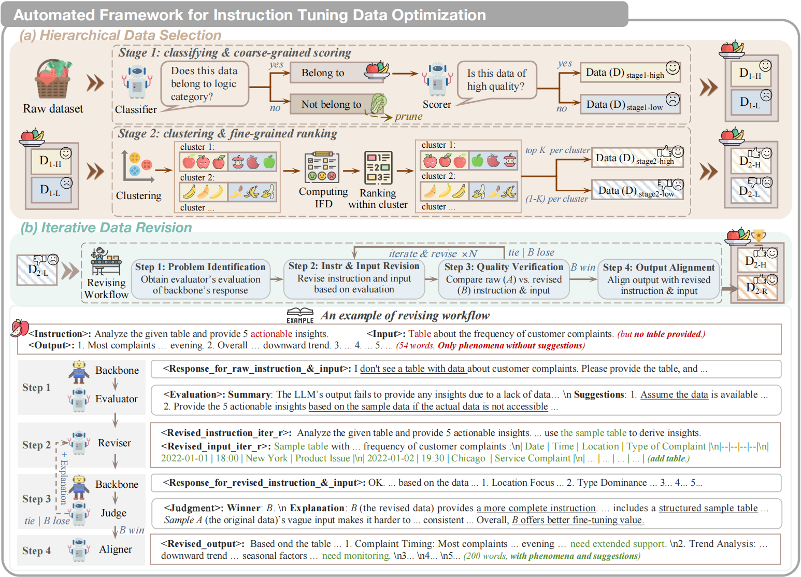
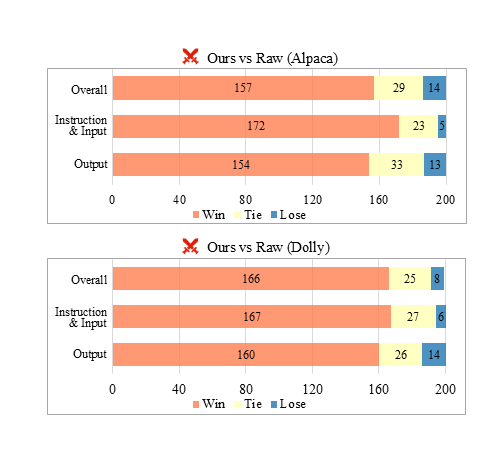

<h1 align="center">AIDO: Automated Instruction Data Optimization for Enhanced LLM Fine-Tuning</h1>

    
    
    

---

## Overview

We propose **AIDO** — an **A**utomated **I**nstruction **D**ata **O**ptimization framework that systematically enhances instruction tuning datasets through **two key stages**:  
**data selection** and **data revision**.

### Two-Stage Optimization Framework

1. **Stage 1 — Data Selection:**  
   AIDO separates high- and low-quality samples using a **coarse-grained LLM scoring** module and a **fine-grained metric ranking** module, ensuring precise filtering of suboptimal data.

2. **Stage 2 — Data Revision:**  
   Low-quality samples are **iteratively revised** via evaluation and semantic consistency checks — correcting factual errors, completing omissions, removing redundancies, and improving alignment between instructions and responses.

### Key Highlights

- **Performance Gains:**  
  - Achieves **61.02%** accuracy on *Alpaca*, surpassing prior SoTA selection and revision methods by **+2.50%** and **+2.09%**.  
  - Achieves **60.39%** accuracy on *Dolly*, outperforming prior SoTA selection and revision methods by **+3.65%** and **+2.60%**.
- **Sample Efficiency:**  
  - Uses **32.69% / 50.00% fewer samples** (vs. raw & best baseline) on *Alpaca*.  
  - Uses **20.00% / 79.66% fewer samples** (vs. raw & best baseline) on *Dolly*.  

| Dataset    | Accuracy (%) | Δ vs Raw data | Δ vs SoTA (Selection) | Δ vs SoTA (Revision) | Data Reduction (vs Raw / SoAT)(%) |
| :--------- | :----------: |:-------------:| :-------------------: | :------------------: | :-------------------------------: |
| **Alpaca** |     61.02    |     +2.50     |         +2.50         |         +2.09        |            32.69 / 50.00          |
| **Dolly**  |     60.39    |     +2.50     |         +3.65         |         +2.60        |            20.00 / 79.66          |

AIDO not only enhances **data quality** but also significantly improves **reasoning, factuality**, and **generalization** across diverse task types.

---

## Human Evaluation

We conducted a rigorous human evaluation with **three trained annotators**, employing **majority voting** to determine outcomes.  
All sample sources and versions were **anonymized** to prevent bias.

- **Lose probabilities:** 7.00% (*Alpaca*), 4.00% (*Dolly*)  
- **Instruction/Input failure rates:** reduced to 2.50% and 3.00%, respectively  
- Demonstrates AIDO’s **comprehensive correction** across all components — instructions, inputs, and outputs.

